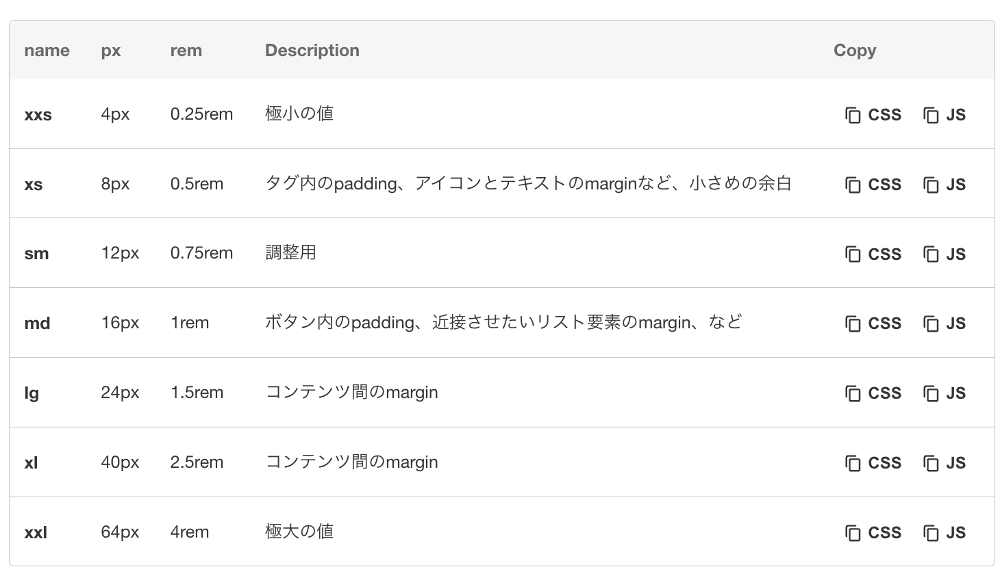

# 概要

あとで書く。

# Ubie UI MCP について

あとで書く。

## 自己紹介

普段、症状検索エンジンユビー(https://ubie.app/)という、toC向けプロダクトの開発エンジニアを行っています。
Ubie 株式会社にはバックエンドエンジニアとして採用をしていただき、2023 年 11 月から Join をしています。
今までのキャリアはどちらかというとフロントエンドよりもバックエンドを主戦にやってきたので、フロントエンドの知識はあまりありませんでした。
また、デザインシステムをしっかり運用している会社に入ったのは Ubie が初めてであり、デザインシステムを使った開発に慣れているわけでもありませんでした。

## Ubie Vitals とは

Ubie のデザインシステムは「Ubie Vitals」という名前で運用されています。

Ubie Vitals とは Ubie で開発・提供するプロダクトが、すべてのユーザー（生活者や医療機関従事者など）に対してよりよい体験を届けていくために、デザイン上において目指すべき指針を言語化したものがデザイン原則です。プロダクト開発に関わるすべての人が、誰でも、効率よく、迷わずに、Ubie らしい表現をするための基礎となっています。


## なぜ作ったのか？背景とモチベーション

2025 年 2 月ごろに、ユビーの中ではかなり複雑なフロントエンドのリニューアルプロジェクトに参画することになりました。チームメンバーはデザイナー、プロダクトマネージャー、そしてエンジニアとしては私の 3 人で、密に協力しながら開発を進めていきました。画面としては 1 画面のみなのですが、かなり色々な機能が詰まったページでした。また、利用ユーザーがかなり多いため、丁寧にかつスピーディに開発を進める必要がありました。

そのプロジェクトの開発の手順は主に以下のようなフローでした。

1. デザイナーが Figma でデザインを作成する
2. 1 で仕上がったデザインをチームメンバー(私、PdM、デザイナー)でレビューする
3. レビューが通ったら、エンジニアである私が AB テストを実装し旧画面との性能比較を行う
4. 私が分析ダッシュボードを作成し、デザイナーと PdM と数値を共有する
5. 検証結果が良ければ、そのまま段階的に全ユーザーにデプロイし、まだ検証結果が良くない場合は、1 に戻ってデザインを修正する


このようなサイクルを高速で回す必要があり、具体的には、週に 3〜4 個の UI パターンを検証するようなスピード感が求められていました。

### AI は Ubie Vitals のコンテキストを読み込んでくれない

私のようなフロントエンドに精通していないエンジニアが、スピーディに複雑な UI を実装するためにはデザインシステムをうまく活用しながら、かつ AI に頼ってコードを書く必要がありました。
しかし、AI に頼るとなかなか Ubie Vitals のコンテキストを読み込んでくれません。AI はメジャー OSS をインプットしてコードを書くことはある程度できてきているのですが、社内の独特なコンテキストを一気に読み込んで解釈することは苦手です。
いくつか以下のようなデザインシステムのインプットを試してみましたが、なかなか納得のいくような精度まで上がることはありませんでした。

- Cursor Rules に Ubie Vitals のコンポーネントを全て読み込ませる
- node_modules 内の Ubie Vitals のディレクトリを参照させる
- Ubie Vitals の Web サイトを参照させる

これらの方法はすべて、コンテキストサイズが膨大すぎることが一番の原因でした。

### MCP の登場

そんな中で MCP(Model Context Protocol) という技術が注目され始めました。

claude の MCP の冒頭解説をみると以下のように書いてあります。

> Think of MCP like a USB-C port for AI applications. Just as USB-C provides a standardized way to connect your devices to various peripherals and accessories, MCP provides a standardized way to connect AI models to different data sources and tools.

この説明を見て、データソースとしてのデザインシステムを USB のように AI というデバイスに接続することができるならば、AI にデザインシステムのコンテキストを読み込んでくれるのではないかと思いました。

ただ、なかなかまだ当時は MCP という技術がなんとなくすごいということはわかっていたのですが、具体的にどんなユースケースで使っていけば良いのか、社内でも試行錯誤している段階でした。ですのであまり期待はしていなかったのですが、勉強がてら試作を作ってみたところかなり精度高くコードを生成できるようになりました。

Figma の MCP を使って、1 ラリーでここまでのコードを生成してくれるようになりました。


## 実装方針

実際の実装を見てみましょう。実装は驚くほど簡単です。
前提として意識していたことは、社内の人間のみが使えればそれでよいということ、セキュリティの観点からローカルである程度完結をさせたいという点、最後に運用をできるだけ簡単にしたいという点があります。

最後の観点がとても重要で、Ubie はまだまだ大きい会社ではなくデザインシステムにたくさんのリソースを寄せられるような判断は今はできません。そのため、今後 Ubie Vitals にコンポーネントが追加、改修されたとしても MCP 自体を更新する必要がないようにしたいということです。
そのため、以下のような実装方針で進めることにしました。

1.  Ubie UI のコードをベースに MCP を実装する
2.  コードが変更されたら、その変更を MCP に自動で反映されるようにする

## Setup 方法

以下のリポジトリを clone します。

```bash
git clone https://github.com/ubie-oss/ubie-ui.git
git clone https://github.com/ubie-oss/design-tokens.git
git clone https://github.com/ubie-oss/ubie-icons.git
```

- **ubie-ui** : Ubie のデザインシステム Ubie Vitals で定義されたコンポーネントを配布するためのライブラリです。React ベースのプロジェクトでの実装を想定しています。
- **design-tokens** : Ubie 製品で定義されているデザイントークンを開発で利用するためのパッケージです。デザイントークンは JSON 形式で管理されており、Style Dictionary を利用して各プラットフォームに対応した形式に変換されます。
- **ubie-icons** : Ubie のデザインシステム Ubie Vitals で定義されたアイコンを配布するためのライブラリです。
  - Icons List：https://vitals.ubie.life/elements/icons/


社内のフロントエンドを触るエンジニアはすでにこれらのリポジトリを clone している人が多いため、そのまま使うことができます。まだ clone していない人にとっては少し手間が発生しますが、そこは許容しています。

また、これは一応 OSS なので、誰でもみられるようになっています。

そしてお手元の MCP 設定ファイルに以下を追加します。

```json
{
  "mcpServers": {
    "ubie-ui-mcp": {
      "command": "npx --yes ubie-ui-mcp-server",
      "args": [
        "--ubie-ui-dir",
        "/path/to/ubie-oss/ubie-ui",
        "--design-tokens-dir",
        "/path/to/ubie-oss/design-tokens",
        "--ubie-icons-dir",
        "/path/to/ubie-oss/ubie-icons"
      ]
    }
  }
}
```

これで Setup は完了です。

## 全体的な設計

上記で説明したように、MCP の設定ファイルを作成したときに、clone した ubie-ui、design-tokens、ubie-icons のディレクトリを MCP の tools に渡しています。そのディレクトリをローカルで参照し、MCP の tools を実行することで、AI にコンポーネントの一覧、スタイルの種類、デザイントークンを提供しています。

## 主な機能

Ubie UI MCP は以下のような機能を MCP の tools を使って AI に提供します。

- get-components
- get-style-types
- get-design-tokens
- get-ubie-icon-list
- get-ubie-icon-detail

### get-components - コンポーネントの一覧を取得する

コンポーネントの一覧を取得するための tool です。

```ts
server.tool('get-components', 'Get components for ubie-ui', async () => {
  try {
    const componentContents = globSync(
      `${ubieUiDir}/src/components/**/*.tsx`
    ).map((path) => {
      const content = readFileSync(path, 'utf-8');
      return {
        type: 'text',
        text: content,
      } as const;
    });
    return {
      content: componentContents,
    };
  } catch (error) {
    console.error('Error reading component files:', error);
    throw error;
  }
});
```

まず、`globSync` を使って、`ubie-ui` の `src/components` ディレクトリ以下のすべての `.tsx` ファイルを取得します。

```ts
const componentContents = globSync(`${ubieUiDir}/src/components/**/*.tsx`);
```

そして、それぞれのファイルの内容を読み込み、`text` として返します。

```ts
const content = readFileSync(path, 'utf-8');
```

そして、`text` として返します。

```ts
return {
  content: componentContents,
};
```

実際に取得したコンポーネントの一覧は以下のようになります。

> ubie ui mcp からコンポーネント一覧を取得して

```plain

⏺ ubie-ui-mcpから以下のコンポーネント一覧を取得できました：

  レイアウト系
  - Stack - 縦方向レイアウト
  - Flex - フレックスボックスレイアウト
  - Box - パディング、マージン、背景色等の設定
  - Center - 中央寄せレイアウト

  フォーム系
  - Input - テキスト入力
  - TextArea - 複数行テキスト入力
  - Select - セレクトボックス
  - Checkbox/CheckboxGroup - チェックボックス
  - RadioButton/RadioCard/RadioGroup - ラジオボタン
  - Toggle - スイッチ/トグル

  ボタン系
  - Button - ボタン（プライマリ、セカンダリ等）
  - LinkButton - リンクボタン

  テキスト/表示系
  - Text - テキスト表示
  - Heading - 見出し
  - Label - ラベル
  - ErrorMessage - エラーメッセージ
  - HelperMessage - ヘルプメッセージ

  モーダル系
  - ActionModal - アクションボタン付きモーダル
  - ActionHalfModal - ハーフモーダル
  - MessageModal - メッセージモーダル
  - MessageHalfModal - メッセージハーフモーダル

  その他
  - LinkCard - リンクカード
  - Accordion - アコーディオン
  - CircularProgress - 読み込み表示
```

Box コンポーネントの props を取得してみましょう。

> Box コンポーネントの props を取得して

```plain

  基本props
  - as?: HTMLTagname - レンダリングするHTML要素 (default: div)
  - backgroundColor?: BackgroundColor - 背景色 ('primary' | 'primaryDarken' | 'accent' | 'accentDarken' | 'alert' | 'gray' | 'white')
  - border?: 'gray' | 'grayThick' | 'primary' | 'primaryThick' - ボーダーの種類
  - width?: 'full' - 幅を100%にする
  - radius?: Radius - 角丸 ('xs' | 'sm' | 'md' | 'lg')

  パディング系 (PaddingProps)
  - pt?: Spacing - padding-top
  - pr?: Spacing - padding-right
  - pb?: Spacing - padding-bottom
  - pl?: Spacing - padding-left

  マージン系 (MarginProps)
  - mt?: Spacing - margin-top
  - mr?: Spacing - margin-right
  - mb?: Spacing - margin-bottom
  - ml?: Spacing - margin-left

  テキスト系
  - textType?: 'body' | 'note' - テキストの種類
  - textSize?: BodyFontSize | NoteFontSize - フォントサイズ
  - textLeading?: BodyLeading | NoteLeading - 行送り
  - textColor?: TextColor - 文字色
  - textBold?: boolean - 太字設定

```

> どういう時に Box を使うべきですか？

```plain
⏺ Boxコンポーネントは以下のような場面で使用することが推奨されます：

  主な使用場面

  1. レイアウト用のコンテナとして
  - 要素にパディングやマージンを追加したい時
  - 背景色やボーダーを設定したい時
  - 角丸を付けたい時

  2. Stack/Flexの代替として
  - 単純なレイアウトでStackやFlexが不要な場合
  - より細かいスタイル制御が必要な場合

  3. テキストのスタイリング
  - 特定の範囲のテキストにフォントサイズや色を適用したい時
  - テキストの太字設定を変更したい時

  使用例

  // パディングとマージンの設定
  <Box pt="md" pb="lg" mt="sm">
    <Text>コンテンツ</Text>
  </Box>

  // 背景色とボーダーを持つカード風
  <Box
    backgroundColor="gray"
    border="primary"
    radius="md"
    p="md"
  >
    <Text>カード内容</Text>
  </Box>

  // テキストスタイリング
  <Box textType="body" textSize="lg" textColor="primary">
    重要なメッセージ
  </Box>

  使い分けの指針

  - Stack: 縦方向の等間隔レイアウト
  - Flex: 柔軟な方向・配置のレイアウト
  - Box: 上記以外のスタイリング・単純なコンテナ
  - Center: 中央寄せが主目的

```

Box コンポーネントの適切な props と使い方を教えてくれるようになりました。

### get-design-tokens - デザイントークンを取得する

スタイル定義を取得する tool です。
実装は以下になります。(一部省略)

```ts
server.tool('get-design-tokens', 'Get design tokens', async () => {
  try {
    const designTokens = globSync(`${designTokensDir}/tokens/**/*.json`).map(
      (path) => {
        const content = readFileSync(path, 'utf-8');
        return {
          type: 'text',
          text: content,
        } as const;
      }
    );
    return {
      content: designTokens,
    };
  } catch (error) {
    console.error('Error reading design tokens:', error);
    throw error;
  }
});
```

実装はほとんど get-components と同じですね。

デザイントークンは、Figma で管理をしています。https://www.figma.com/community/file/1139108856002045571


ここで作成されたデザイントークンが、https://github.com/ubie-oss/design-tokens/tokens に格納されているので、そのファイルを一つずつ読み込んで、その内容を MCP の tools に渡しています。

```json
{
  "size": {
    "spacing-xxl": { "value": 4, "attributes": { "note": "64px" } },
    "spacing-xs": { "value": 0.5, "attributes": { "note": "8px" } },
    "spacing-xxs": { "value": 0.25, "attributes": { "note": "4px" } },
    "spacing-lg": { "value": 1.5, "attributes": { "note": "24px" } },
    "spacing-xl": { "value": 2.5, "attributes": { "note": "40px" } },
    "spacing-md": { "value": 1, "attributes": { "note": "16px" } },
    "spacing-sm": { "value": 0.75, "attributes": { "note": "12px" } }
  }
}
```

ユースケースとしては、例えば Spacing というプロパティがあったときに、それぞれの値が何 px なのかを知りたいという時に便利です。

> Spacing は具体的にそれぞれ何 px ですか？

```plain
⏺ デザイントークンから、Spacingの具体的なpx値は以下の通りです：

  Spacing値とpx換算
  - xxs: 4px (0.25rem)
  - xs: 8px (0.5rem)
  - sm: 12px (0.75rem)
  - md: 16px (1rem)
  - lg: 24px (1.5rem)
  - xl: 40px (2.5rem)
  - xxl: 64px (4rem)

  これらの値は、パディング(pt, pr, pb, pl)やマージン(mt, mr, mb, ml)、およびStack/Flexコンポーネントのspacingプロパティで使用できます。
```

念の為に、デザイントークンを確認してみると正しそうですね。



### get-ubie-icon-list - Ubie のアイコン一覧を取得する

Ubie のアイコンを取得する tool です。

```ts
server.tool('get-ubie-icon-list', 'Get ubie-icon-list', async () => {
  try {
    const ubieIconList = globSync(`${ubieIconsDir}/src/*.tsx`).map((path) => {
      return {
        type: 'text',
        text: path,
      } as const;
    });
    return {
      content: ubieIconList,
    };
  } catch (error) {
    console.error('Error reading ubie-icon-list:', error);
    throw error;
  }
});
```

こちらも実装はほとんど get-components と同じなので詳細は割愛します。

実際に取得したアイコンの一覧は以下のようになります。

> ubie icons からアイコン一覧を取得して

```plain
⏺ ubie-iconsから取得したアイコン一覧です（アイコン名のみ抽出）：

  基本アイコン
  - AddressIcon, AccountIcon, AccountSettingIcon
  - AlertIcon, AlertAIcon, AlertBIcon
  - AmbulanceIcon, ArrowADownIcon, ArrowALeftIcon, ArrowARightIcon, ArrowAUpIcon
  - ArrowBDownIcon, ArrowBLeftIcon, ArrowBRightIcon, ArrowBUpIcon
  - ArrowCDownIcon, ArrowCDownFillIcon, ArrowCLeftIcon, ArrowCLeftFillIcon, ArrowCRightIcon, ArrowCRightFillIcon, ArrowCUpIcon, ArrowCUpFillIcon
  - ArrowDDownIcon, ArrowDLeftIcon, ArrowDRightIcon, ArrowDUpIcon
  - ArrowEDownIcon, ArrowELeftIcon, ArrowERightIcon, ArrowEUpIcon

  チェック・選択系
  - CheckAIcon, CheckBIcon, CheckBFillIcon
  - CheckboxOffOutlineIcon, CheckboxOnOutlineIcon
  - CircleFillIcon, CircleOutlineIcon
  - CloseAIcon, CloseBIcon

  人物・性別系
  - BoyIcon, GirlIcon, ManIcon, WomanIcon, OldManIcon, OldWomanIcon
  - DoctorIcon, NurseIcon
  - FemaleHumanIcon, FemaleSymbolIcon, MaleHumanIcon, MaleSymbolIcon, GenderHumanIcon, GenderSymbolIcon

  医療・薬系
  - MedicalSymbolOutlineIcon, MedicalSymbolFillIcon, MedicalHeartIcon, MedicalFormIcon, MedicalIdIcon, MedicalIdOffIcon
  - MedicineTabletIcon, MedicineSyrupIcon, MedicinePowderIcon, MedicineInjectionFormIcon, MedicineAutoInjectorIcon, MedicineEnemaIcon, MedicineSuppositoryIcon, MedicineIntravenousDripIcon
  - CapsuleIcon, CapsuleTabletIcon, InjectionIcon, StethoscopeIcon, FirstAidBoxIcon, MaskIcon
  - EcgOutlineIcon, EcgHeartFillIcon

  UI操作系
  - EditIcon, PenIcon, MenuIcon, SettingIcon, SearchIcon, FilterIcon, SortIcon, SortAtozIcon
  - ShareIcon, ShareBIcon, SendIcon, UploadIcon, DownloadIcon, CopyIcon
  - ShowOutlineIcon, ShowFillIcon, HideOutlineIcon, HideFillIcon
  - LockIcon, UnlockIcon, SecurityIcon

  ファイル・フォルダ系
  - FileIcon, FolderIcon, ImageIcon, CameraIcon
```

### get-ubie-icon-detail - Ubie のアイコンの詳細を取得する

アイコンの詳細を取得する tool です。
上記の一覧から使いたいアイコンを選択すると、そのアイコンの詳細を取得してくれます。

```ts
server.tool(
  'get-ubie-icon-detail',
  'Get ubie-icon-list',
  {
    iconName: z.string(),
  },
  async ({ iconName }) => {
    try {
      const ubieIconDetail = readFileSync(
        `${ubieIconsDir}/src/${iconName}.tsx`,
        'utf-8'
      );
      return {
        content: [
          {
            type: 'text',
            text: ubieIconDetail,
          },
        ],
      };
    } catch (error) {
      console.error('Error reading ubie-icon-detail:', error);
      throw error;
    }
  }
);
```

iconName を指定すると、そのアイコンの詳細を取得してくれます。

上記の一覧と組み合わせると、以下のような使い方ができます。

> ユーザーに警告をするためのアイコンが欲しいのですが、どれを使えばいいですか？

```plain
⏺ ユーザーに警告をするためのアイコンとしては、以下のものが適しています：

  推奨アイコン

  1. AlertIcon - 最も一般的な警告アイコン
  2. AlertAIcon - バリエーション1
  3. AlertBIcon - バリエーション2

  これらの中で AlertIcon が最も標準的で汎用的な警告アイコンです。

```

> AlertIcon, AlertAIcon, AlertBIcon は何が違いますか？

```plain
⏺ AlertIcon、AlertAIcon、AlertBIconの違いは以下の通りです：

  AlertIcon と AlertAIcon

  同じデザイン - 三角形の警告アイコン
  - 三角形のアウトライン
  - 中央に縦線（感嘆符の縦棒）
  - 下部に点（感嘆符の点）

  AlertBIcon

  円形の警告アイコン
  - 円形のアウトライン
  - 中央に縦線（感嘆符の縦棒）
  - 下部に点（感嘆符の点）

  まとめ

  | アイコン       | 形状  | 用途                          |
  |------------|-----|-----------------------------|
  | AlertIcon  | 三角形 | 一般的な警告・注意                   |
  | AlertAIcon | 三角形 | AlertIconと同じ（おそらく命名の一貫性のため） |
  | AlertBIcon | 円形  | より穏やかな警告・情報                 |

  使い分けの推奨：
  - 緊急度が高い警告: AlertIcon / AlertAIcon (三角形)
  - 情報的な注意: AlertBIcon (円形)

  三角形は一般的により強い警告を表し、円形はより穏やかな注意喚起を表現します。
```

確認すると、AlertAIcon と AlertBIcon は三角形と円形で違いがありました。
おそらくアイコンの詳細で svg を返却しているので、そこから AI が解釈してくれているのかなと思います。


## 作ったことの成果

## Ubie の個人のアイデアを吸い上げる環境
